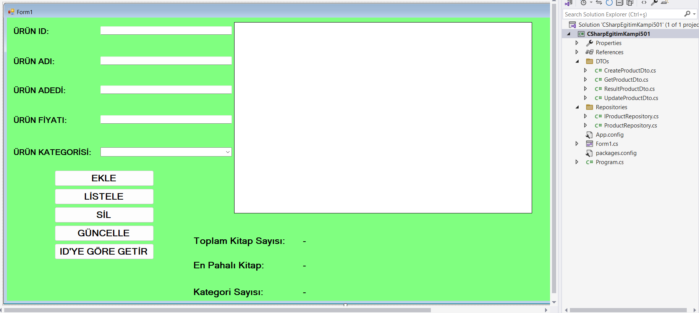

# ☕ CSHARP EĞİTİM KAMPI 501 EĞİTİMİ

Bu eğitim kampında windows form üzerinde CRUD işlemlerini uyguladık. MS SQL'de bir product tablosu oluşturduk. ORM aracı olarak dapper kullanarak bu tablodaki verileri form üzerine getirdik. 

---

### Kullandığımız teknolojiler

- Windows form
- MS SQL
- Dapper 
- DTO
- Repositories
- C#

---

